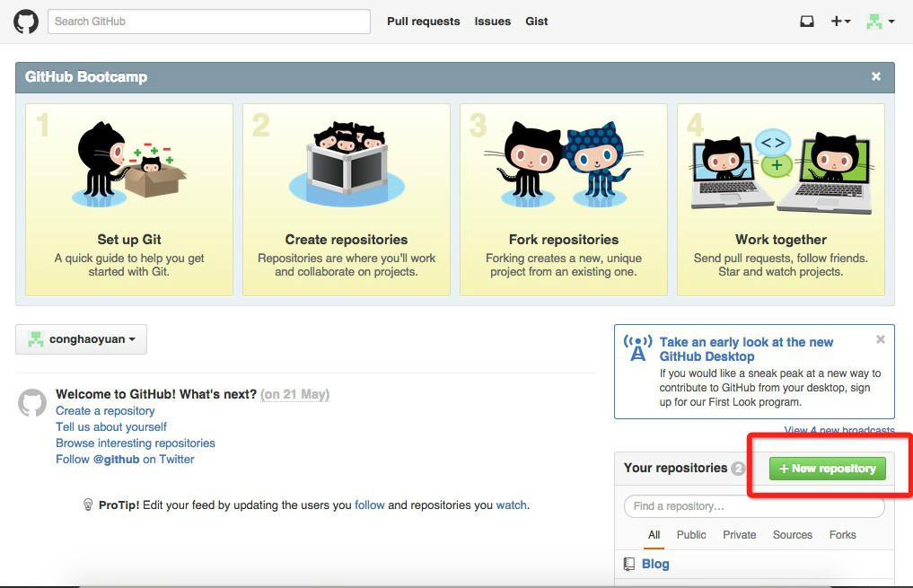

之前看多很多coder自己搭建的博客，把自己的一些经验以及好用的小工具之类的写在自己博客。感觉很酷。随想自己也建一个。其实没有想象中的那么难，但是可能涉及到的知识点有点多。

# 少废话 走起

## 1.申请github

这个不用我说了吧，自己去申请吧。<https://github.com/>  
申请完成后到了这里：  
  
看到右下角那个红框框了么。点击去吧。`创建一个仓库`

好了到了第二步了，写一个你的博客的目录吧。我自己写的是`Blog` 这个自己想吧。哈哈。。。  
    
抓紧时间，创建成功到下一步。另外下边的那些选项可以选，可以不选，因为需要什么东西都可以自己添加上。不要觉得我不专业哟。。。。

你成功到达第三步了。看到那个连接了木有。  
`https://github.com/xxxxxxxx/newBlog.git`先复制下来这个网址。
  
其实下边的命令就是我们所需要的，只不过需要稍微改动一下下。。。

## 2.安装git
这个有很多方式安装啊。
